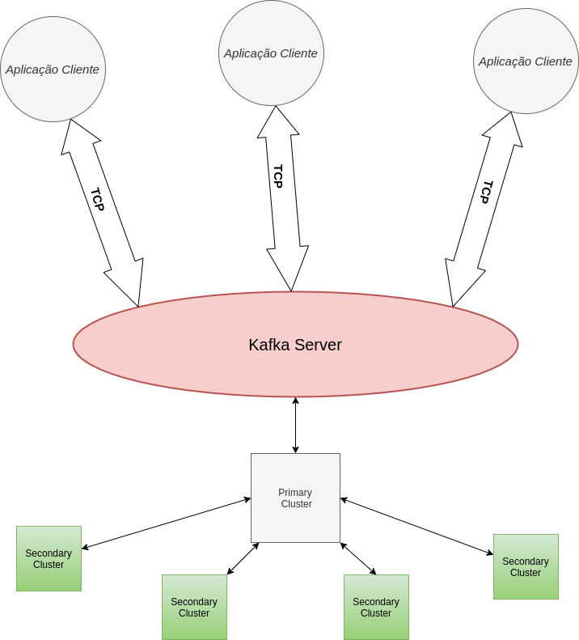
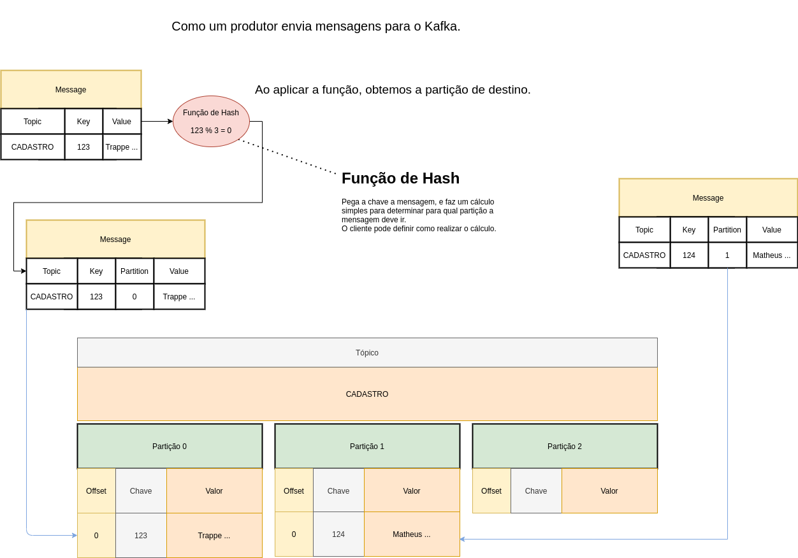
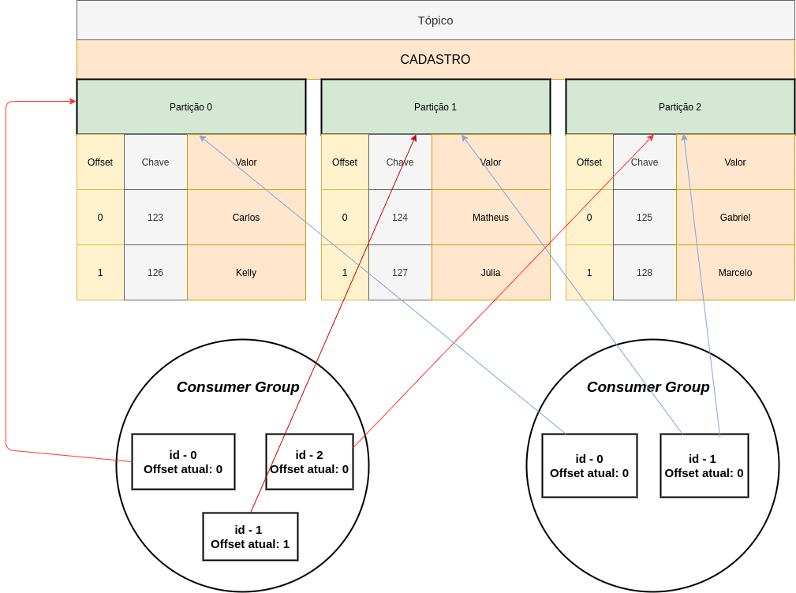
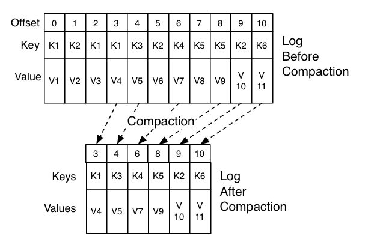
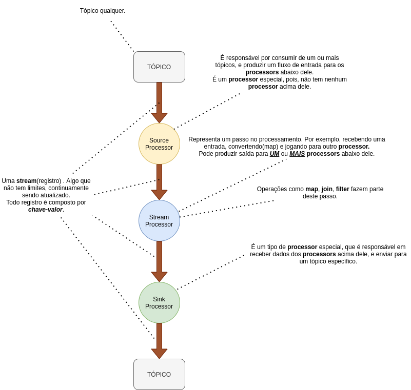
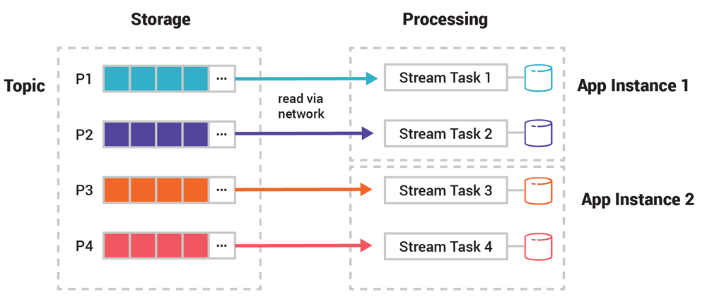
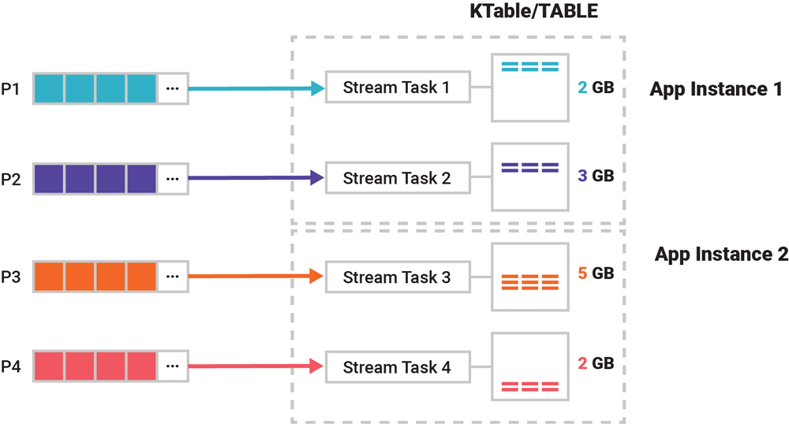
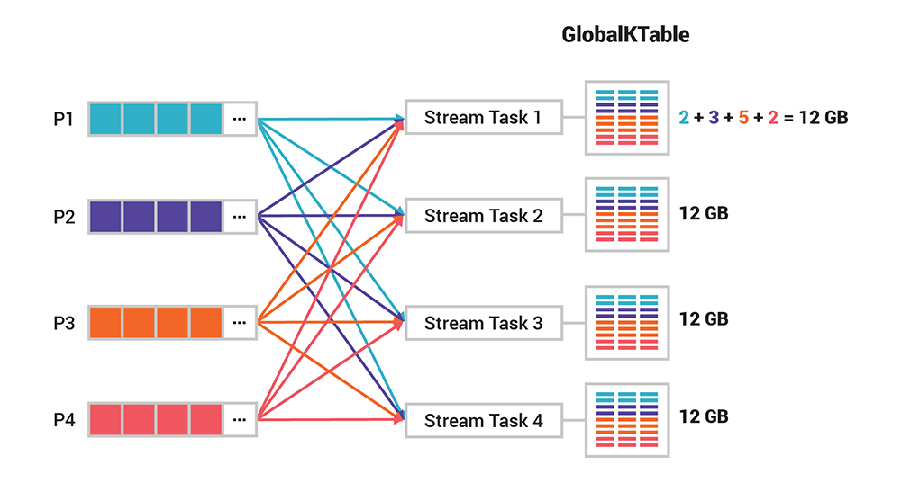

# Sumário
- [Sobre](#Sobre)   
- [Introdução ao Kafka](#Introdução-ao-Kafka)
    + [Arquitetura](#Arquitetura)
    + [Conceitos Principais](#Conceitos-Principais)
        + [Produtores](#Produtores)
        + [Consumidores](#Consumidores)
        + [Tópicos](#Tópicos)
            + [Particionamento](#Particionamento)
            + [Retenção](#Retenção)
            + [Compactacao](#Compactacao)
- [Introducao ao Kafka Streams](#Introducao-ao-Kafka-Streams)
    + [Topologia](#Topologia)
    + [KStream](#KStream)  
    + [KTable](#KTable)
    + [GlobalKTable](#GlobalKTable)
    + [Operações](#Operações)
    + [Tópicos Internos](#Tópicos-Internos)   
    + [Limitações](#Limitações)
- [Termos](#Termos)
- [Referências](#Referências)
- [Projeto Demo](#Projeto-Demo)
- [Comandos Úteis](#Comandos-Úteis)

# Sobre
Este projeto faz parte de uma apresentação que fiz para a equipde de TI do [Grupo Dimed](http://www.grupodimed.com.br/) no dia 12-08-2021.    
Fica aqui o meu agradecimento ao pessoal da Dimed pela oportunidade.   

# Introdução ao Kafka
Kafka é uma plataforma de streaming de eventos que pode ser utilizada em inúmeros cenários, desde sensores, IOT, confirmação de pagamentos e etc.     

- ## Arquitetura

    Utiliza a arquitetura *"cliente x servidor"* que se comunicam pelo protocolo TCP.   

    - Servidor

        O kafka roda em um cluster de um ou mais servidores. Alguns destes servidores formam a camada de armazenamento, e são chamados de **Brookers**. 
        O cluster é escalável e tolerante a falhas, se qualquer um destes servidores falhar, os outros servidores irão tomar conta do trabalho e garantir a continuidade das operações sem nenhuma perda de informação.

    - Cliente

        Permitem se comunicar com o cluster, seja para escrever ou ler. 

    

- ## Conceitos Principais

    Um **"evento"** é algo que aconteceu no mundo real. Quando você escreve/ler dados do Kafka, você faz isso atráves de eventos.   
    De forma conceitual, um evento tem uma chave, valor, timestamp e metadados opcionais(headers).   
    
    - ### Produtores

        São aplicações clientes que publicam(escrevem) eventos para o Kafka.     
        O **Produtor** envia mensagens diretamente para o brooker que é o líder da partição. O produtor tem total controle para definir para qual partição enviar as mensagens.    
        Isto pode ser feito de forma aleatória, utilizando uma função de dispersão.      
        
        Enviando a mesma chave sempre para a mesma partição, permite que os consumidores tenham suposições sobre a localidade dos eventos.    
        **Nota:** Caso seja incrementada os números de partições de um tópico quando ele já tem mensagens, a chave que antes ia para a partição 0, com o aumento do número de partições, pode ir para a partição 3 por exemplo. 

        **Exemplo:** Como um produtor envia mensagens.    
        

    - ### Consumidores

        São aplicações clientes que se inscrevem para ler e processar estes eventos.    

        O **Consumidor** funciona realizando "buscas"(busy-waiting) aos brookers líderes da partição que ele quer consumir.   
        O consumidor especifica o offset(deslocamento) em cada requisição e recebe de volta uma porção de eventos ordenados a partir daquele offset.

        - #### Posição do Consumidor

            O tópico é dividido em um conjunto de partições ordenadas, cada uma sendo consumida por **exatamente um consumidor** dentro de um grupo de consumidores.   
            Sendo assim, a posição de um consumer em cada partição é apenas um único inteiro(que fica salvo no ).     
            Com isso, um consumidor pode reprocessar informação caso seja necessário.

            **Obs: É possível um consumidor consumir 1-N partições, mas uma partição só pode ser consumida por somente um consumidor.**     

            **Exemplo:** Como um consumidor "obtém" mensagens   
            

        Se sabemos que uma partição só pode ser consumida por um consumer de um grupo de consumidores, sendo assim, o que acontece quando inserimos um novo consumidor, uma consumer cai ou, uma nova partição? **Rebalanceamento**.    
        Os consumers irão perder a atribuição, e as partições serão atribuidas novamente. Pode acontecer do consumidor ser atrelado a outra partição. 
 
    **Obs:** Produtores e Consumidores são desacoplados(isso é, não dependem um do outro).   
    Por exemplo, produtores nunca precisam esperar que exista algum consumidor.   

    Um consumidor, pode também ser um produtor. Isto é, ele pode se inscrever em um tópico, realizar algum processamento(por exemplo, enriquecer a informacao, buscando dados de outra origem(i.e Banco de Dados)) e, posteriormente escrever em outro tópico.

    + ### Tópicos

        Eventos são organizados e armazenados de forma durável em **tópicos**. Pense como um tópico sendo uma pasta em algum sistema de arquivos, e os eventos são os arquivos deste diretório.

        Tópicos podem sempre ter 0-M produtores e 0-M consumidores. Eventos não são removidos após serem lidos, isso permite que você possa reprocessar os eventos quantas vezes precisar.    

        * #### Particionamento

            Os **"tópicos"** são particionados, significando que um tópico é espalhado em um número de "buckets" em diferentes brokers(quando configurado assim).    
            A forma de distribuição dos dados é muito importante para a escabilidade porque permite que aplicações clientes possam ler e escrever de vários brookers no mesmo momento.

            Quando um novo evento é publicado em um tópico, ele, na verdade é inserido a alguma da(s) partição(ões) do tópico. Eventos com a mesma chave são inseridos na mesma partição, e o Kafka **garante** para qualquer consumir que está consumindo uma partição de um tópico, que ele irá sempre ler os eventos seguindo a ordem que eles foram inseridos.    

            Isso é muito importante, pois, algo que precisa ter ordem(por exemplo, eventos de alterações de um pedido) precisam ser armazenadas na **mesma partição**, caso contrário, a ordem não será garantida!

            As **chaves** são muito importantes aqui, pois, são elas quem definem para qual partição o evento irá. Caso, o evento não tenha uma chave definida, é feito um Round Robin, para decidir para qual partição a mensagem irá!    

            Geralmente, a partição de destino de tal evento(pode ser conhecido como "partition-key"), é obtida através de uma função de hash com a chave sendo a sua entrada(pense como uma tabela de dispersão).    
            Pelo lado negativo, isto pode derrubar algum brooker.    
            Por exemplo, digamos que um tópico de interacoes de usuário, o cpf do usuário seja a chave, e este usuário tenha 80% das interacoes, no minimo, 80% do trafego, ira para o mesmo brooker.        
            Entao, caso o tópico não necessite ordem, não existem motivos(salvo a politica de retenção) para utilizar "partition-key".

            Para deixar os dados tolerantes a falha e altamente disponível, cada tópico pode ser **replicado**. 
            - **Exemplo:** Com fator de replicacao igual a 1.    

                Existira apenas o lider com o dado apenas para si.  

            - **Exemplo:** Com fator de replicacao igual a 2.   

                Existira um lider e um seguidor, ambos com uma copia dos dados.

            - **Exemplo:** Com fator de replicacao igual a 3.   

                Existira um lider e dois seguidores, ambos com uma copia dos dados. 

            O **"paralelismo"** tem tudo haver com o número de partições! Quanto maior o número de partições, mais threads de consumers podemos ter para um tópico. 

        * #### Retenção

            Eventos podem ficar retidos por tempo determinado(por exemplo, 5 minutos, 10, o tempo é variavel), tempo(útil em casos que consumers tomam ações em tempo real), e espaço em disco, assim, como, podem ficar retidos somente um elemento por chave(chamado de compactação).

        + #### Compactação

            A compactacao garante que o Kafka ira **"sempre"** manter no minimo(no minimo, porque a exclusao das mensagens antigas, não ocorre de forma instantanea) o ultimo valor de uma mensagem com determinada chave.   

            Por exemplo, se eu produzir uma mensagem com a chave 10, e logo, depois, outra mensagem com a mesma chave, a primeira mensagem será marcada para remoção. Mesmo marcada para remoção, se voce plugar um consumer, ele "pode" conseguir ler as duas mensagens. Porém, consumers que forem plugados posteriormente, ou, ate mesmo consumers que fizerem um *reprocessamento*, provavelmente não irão receber a mensagem, porque, a thread que executa a compactação rodou.

            **Exemplo:** Como ocorre a compactacao    
            

# Introducao ao Kafka Streams
É uma biblioteca cliente do Kafka. Os dados de entrada e saida estão/são armazenados nos clusters do Kafka.  
**É importante saber que o processamento é feito no lado da aplicação(isto é, aplicação que adicionou a biblioteca).**   

Quando enviamos dados para um tópico, consideramos que este tópico tem um dado cru(raw), e geralmente, precisamos tomar alguma ação(como, enriquecer dados) quando este tópico recebe uma nova mensagem.    
Com a biblioteca do Kafka Streams, conseguimos realizar operações entre tópicos, dentro da própria aplicação.   

Por exemplo, conseguimos juntar dois tópicos distintos, e transformar em um tópico mais enriquecido. Podemos filtrar dados, realizar agregações(semelhanças com bancos de dados relacionais).

- ## Topologia
   
    Uma topologia, nada mais é do que uma abstração lógica da aplicação utilizando Kafka Streams.    
    

- ## KStream

    É uma abstração de um fluxo de eventos sem limite.    
    Os registros em uma KStream são imutáveis, é apenas possível inserir novos registros.

    **Streams representam história**

    Assim como um consumer, cada **"KStream"** é atribuída a somente uma partição.

    

    Como analogia, pense como um próprio tópico do Kafka.

- ## KTable

    Fornece uma abstração para dados mutáveis, com limite.    
    Novos eventos, são inseridos na tabela, e eventos com chaves repetidas podem ser atualiazados e removidos(atráves de Tombstone Records).

    **Tables representam estado**

    Assim como um consumer, cada **"KTable"** é atribuída a somente uma partição.   
    Cada tabela tem seu próprio **"armazenamento de estado"**.    
    Se o KTable de tópico tem dez partições, o armazenamento de estado terá 10 partições também.

    

    Como analogia, pense como uma tabela de um banco de dados relacional, ou, até mesmo, um tópico com a retenção configurada como compactação.

- ## GlobalKTable

    O design de particionamento é muito útil para escalonar e performance.    
    Porém, algumas vezes, existe algum caso que precisamos ter acesso a todos os eventos.  
    Diferentemente da **KTable**, uma **GlobalKTable** não é particionada, ao invés disso, te fornece acesso total dos dados em cada consumer(stream task).    

    

- ## Operações

    Entre as operações possíveis, as mais comuns são map, filter, join(join entre streams, tables), count etc.

- ## Tópicos Internos

    Tópicos internos são utilizados internamente pelo Kakfa Stream enquanto o mesmo está em execução.    
    **Exemplo:** Nome comum utilizado pelos tópicos internos:   
    ```bash
    <id-da-aplicação>-<nome-operador>.<sufixo>
    ```
    Onde: id da aplicação é definido por property, e nome-operador -> map, filter etc ...

- ## Limitações

    Diferentemente de um consumer normal, em uma aplicação com Kafka Streams, todos os tópicos de entrada, **precisam ter o mesmo número de partições**. Isso porque, você não conseguirá fazer nenhum join se o TOPICO X tem 3 partições, com o tópico Y que tem 12 partições. Lembra que o join é feito por chaves? 

    Estas restrições se aplicam para KStream e KTable. GlobalTable não se aplica!

# Termos 
Alguns termos que são utilizados nas documentações.

- Stateful

    Algo que mantém estado.   
    Por exemplo: Deve lembrar do **"estado"** de eventos anteriores quando está processando eventos atuais.    

- State Store

    Kakfa Streans fornece o que é chamado de **armazenamento de estado(state store)**, que podem ser utilizados por aplicações para armazenar e buscar dados. 
    É armazenado no disco local onde a aplicação executa, ou em servidores *ksqlDB/rocksDB*.

# Referências
- [Apache Kafka](https://kafka.apache.org/documentation/)
- [Apache Kafka Streams](https://kafka.apache.org/28/documentation/streams/)
- [Confluent Apache Kafka Streams Introduction](https://www.confluent.io/blog/kafka-streams-tables-part-1-event-streaming/)
- [Streams Joins Confluent](https://www.confluent.io/blog/crossing-streams-joins-apache-kafka/)

# Projeto Demo
O projeto consiste em uma demonstração do poder de Kafka Streams ...

Temos duas **KTables**, uma para o tópico *CUSTOMER* e outra para o tópico *CUSTOMER-ADDRESS*.   
Qualquer evento que chega nestes tópicos, irá disparar o gatilho de join(inner join) entre elas, e produzir o dado atualizado para uma tabela que o Kafka Streams mantém internamente.    

Um **KStream** para o tópico **ORDER**, no qual, consiste em pedidos realizados.  
Essa **KStream** faz um join(inner join) com a tabela de CUSTOMER(já com o join entre elas). Essa KStream dispara o gatilho do join. Qualquer entrada nela, disparará o join!

Uma **GlobalKTable**(pois, este tópico só tem uma partição) para o tópico **ITEM**.

Ao ser feito um novo pedido, iremos pegar o campo customerId do pedido, fazer um join com a tabela derivada do join entre **CUSTOMER** e **CUSTOMER-ADDRESS**, e com o campo itemId, iremos fazer um join com a GlobalKTable de itens.   
Apos isso, o resultado sera enviado para o topico **ORDER-MAIL**, no qual, poderia enviar um e-mail para o cliente. 


Para executar o projeto, basta rodar: 
```bash
./init.sh
```

# Comandos Úteis
Inserir a localização do Kafka(scripts para se comunicar) na variável: KAFKA_PATH.   
**Exemplo:**   
```bash
export KAFKA_PATH=<caminho-absoluto>
```
Por exemplo, no meu caso, fica:    
```bash
export KAFKA_PATH=/opt/Kafka
```


